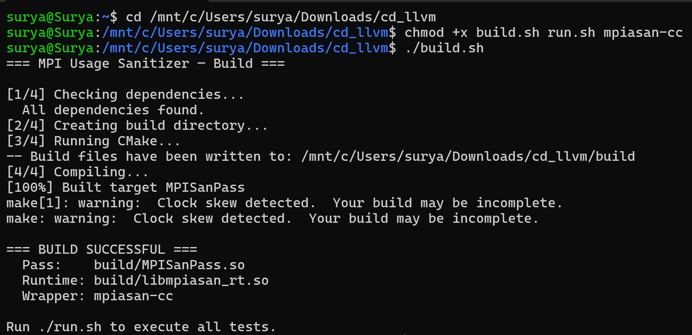
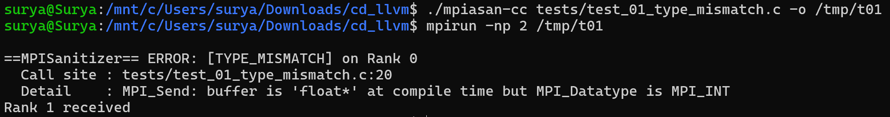
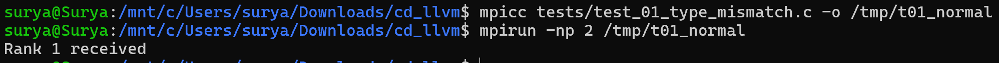
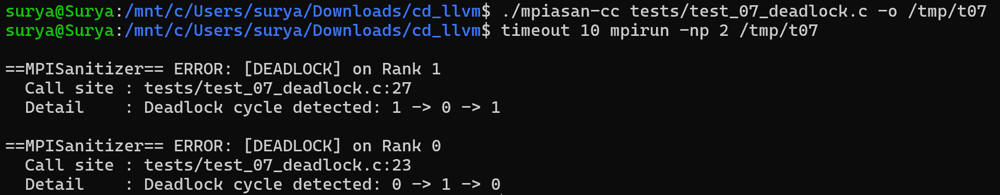
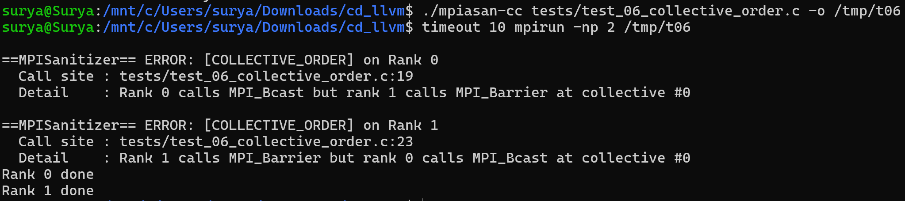
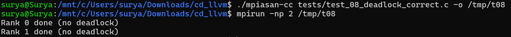
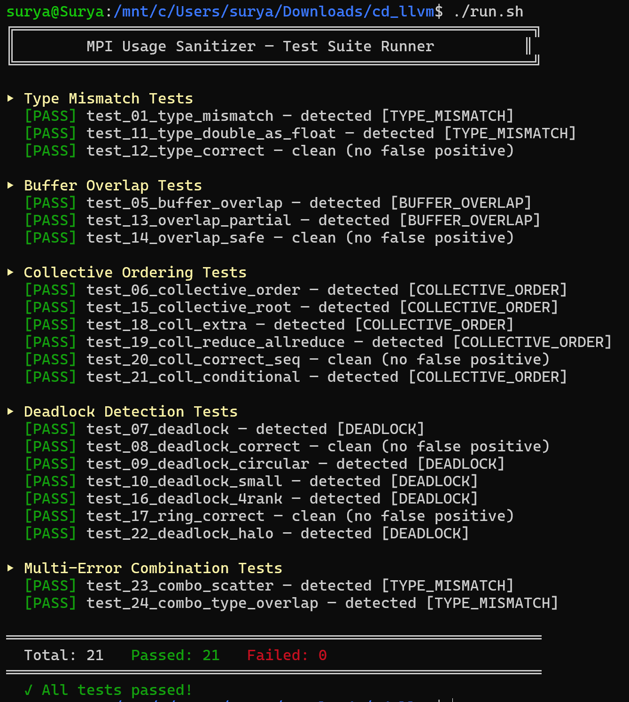

# Demo Screenshots

## 1. Build Successful

## 2. Type Mismatch — WITH Sanitizer (Error Detected)

## 3. Type Mismatch — WITHOUT Sanitizer (Error NOT Detected)

The same buggy program runs silently with `mpicc` — the bug goes completely undetected.

## 4. Deadlock — WITH Sanitizer (Error Detected)

## 5. Collective Ordering — WITH Sanitizer (Error Detected)

## 6. Correct Program — No False Positive

A correct MPI program runs cleanly with no false alarms.

## 7. Full Test Suite (./run.sh)

All 21 tests pass — 100% detection rate, 0 false positives.
