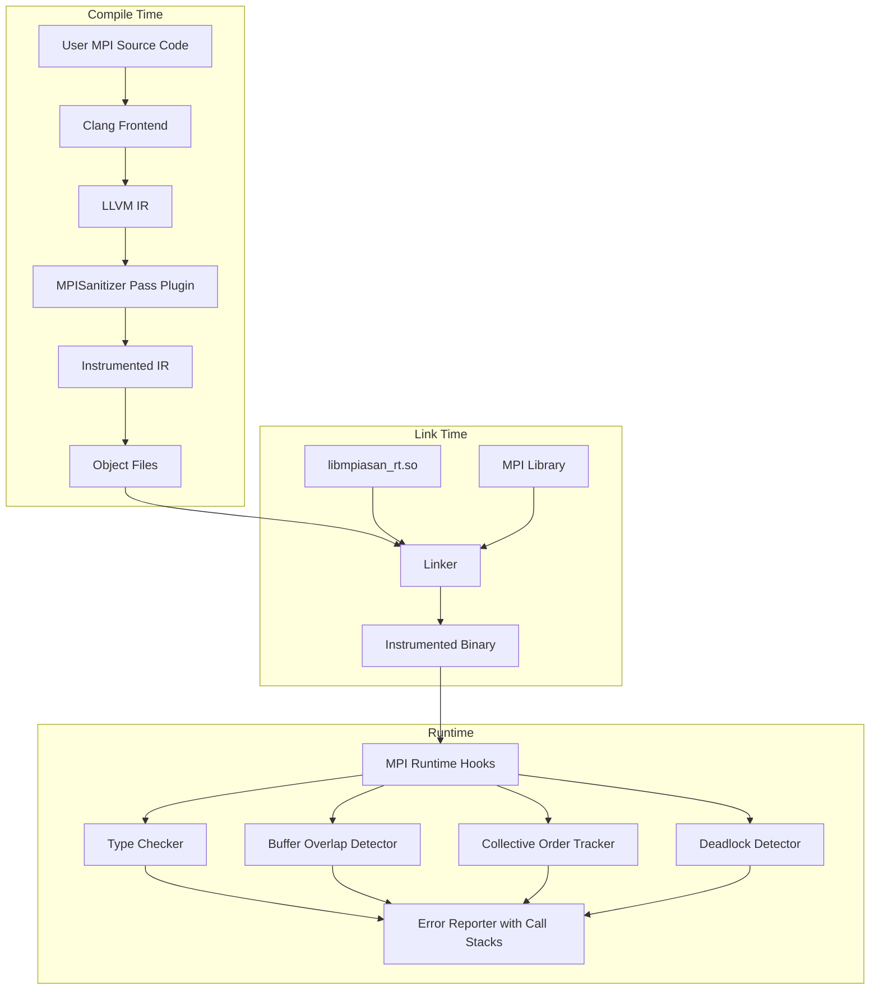

# Assignment 26 — Compiler-Integrated MPI Usage Sanitizer

## Goal

Build an LLVM IR instrumentation pass + runtime library that detects common MPI usage errors at runtime: **type mismatches**, **buffer aliasing/overlaps**, **collective ordering violations**, and **deadlock-prone call orderings**. The tool intercepts MPI calls at the IR level, captures metadata (buffer types, sizes, communication patterns), and reports errors with call stacks and MPI rank info.

---

## Architecture Overview



---

## Project Directory Structure

```
cd_llvm/
├── CMakeLists.txt                  # Top-level CMake
├── README.md
│
├── pass/                           # LLVM Instrumentation Pass
│   ├── CMakeLists.txt
│   ├── MPISanPass.cpp              # Main ModulePass
│   ├── MPICallIdentifier.h/.cpp    # MPI function signature matching
│   └── TypeMetadataExtractor.h/.cpp# Extract type/size info from IR
│
├── runtime/                        # Runtime Library
│   ├── CMakeLists.txt
│   ├── mpiasan_rt.h                # Public hook declarations
│   ├── mpiasan_rt.cpp              # Hook implementations & dispatch
│   ├── TypeChecker.h/.cpp          # Type mismatch detection
│   ├── BufferTracker.h/.cpp        # Buffer overlap detection
│   ├── CollectiveTracker.h/.cpp    # Collective ordering validation
│   ├── DeadlockDetector.h/.cpp     # Wait-for graph & cycle detection
│   ├── ErrorReporter.h/.cpp        # Formatted error output + stacks
│   └── MPITypeMap.h                # MPI_Datatype → C type mapping
│
├── scripts/
│   ├── mpiasan-cc                  # Compiler wrapper (like mpicc)
│   └── mpiasan-run                 # Run wrapper (like mpirun)
│
├── tests/                          # 15+ test programs with seeded bugs
│   ├── CMakeLists.txt
│   ├── run_tests.py                # Test harness
│   ├── type_mismatch_send_recv.c
│   ├── type_mismatch_bcast.c
│   ├── type_mismatch_scatter.c
│   ├── buffer_overlap_pack.c
│   ├── buffer_overlap_sendrecv.c
│   ├── buffer_alias_isend.c
│   ├── collective_order_mismatch.c
│   ├── collective_missing_rank.c
│   ├── collective_wrong_root.c
│   ├── deadlock_send_send.c
│   ├── deadlock_circular_wait.c
│   ├── deadlock_recv_before_send.c
│   ├── mixed_blocking_nonblocking.c
│   ├── wrong_count_overflow.c
│   ├── correct_program_1.c         # Negative test (no bugs)
│   └── correct_program_2.c         # Negative test (no bugs)
│
└── evaluation/                     # Evaluation on real MPI app
    ├── CMakeLists.txt
    ├── README.md                   # Instructions for CoMD evaluation
    ├── comd_patches/               # Patches to inject bugs into CoMD
    │   ├── type_mismatch.patch
    │   └── collective_order.patch
    └── eval_results.md             # Performance & detection results
```

---

## Proposed Changes — Phase by Phase

---

### Phase 1: Project Skeleton & Build System

Set up CMake infrastructure, LLVM discovery, and MPI discovery so everything compiles.

#### [NEW] CMakeLists.txt (top-level)
- `cmake_minimum_required(VERSION 3.20)`
- `find_package(LLVM REQUIRED CONFIG)` for the pass
- `find_package(MPI REQUIRED)` for runtime and tests
- `add_subdirectory(pass)`, `add_subdirectory(runtime)`, `add_subdirectory(tests)`

#### [NEW] pass/CMakeLists.txt
- Build `MPISanPass` as a `MODULE` shared library (LLVM pass plugin)
- Include LLVM headers, set `LLVM_DEFINITIONS`
- No linking against LLVM libs (plugin uses host symbols)

#### [NEW] runtime/CMakeLists.txt
- Build `mpiasan_rt` as a `SHARED` library
- Link against MPI (`MPI::MPI_C`), pthreads, libunwind/backtrace

---

### Phase 2: LLVM Instrumentation Pass

The pass scans every `CallInst` in the module, identifies MPI calls by name, and inserts pre-call hooks that pass captured metadata to the runtime.

#### [NEW] pass/MPICallIdentifier.h / .cpp

Responsible for recognizing MPI functions and classifying them:

```cpp
enum class MPICallKind {
    Send, Recv, Isend, Irecv,
    Bcast, Scatter, Gather, Alltoall, Reduce, Allreduce, Barrier,
    Wait, Waitall, Test,
    SendRecv,
    Init, Finalize, Comm_rank, Comm_size,
    Unknown
};

// Maps function name → MPICallKind
MPICallKind classifyMPICall(StringRef funcName);

// Returns argument indices for buf, count, datatype, src/dest, tag, comm
// based on the call kind (different MPI functions have args at different positions)
struct MPIArgLayout { int bufIdx, countIdx, typeIdx, peerIdx, tagIdx, commIdx; };
MPIArgLayout getArgLayout(MPICallKind kind);
```

#### [NEW] pass/TypeMetadataExtractor.h / .cpp

Extracts compile-time type information from the LLVM IR:

- Walk `bitcast`/`getelementptr` chains to find the **underlying allocated type** behind a `void*` buffer argument
- Compute **element size** from `DataLayout` + LLVM `Type`
- Encode type info as an integer type-ID (e.g., `float=1, double=2, int=3, ...`)
- Handle cases where the type cannot be determined (return `UNKNOWN_TYPE`)

#### [NEW] pass/MPISanPass.cpp

Main `ModulePass` using the new PassManager plugin API:

```
struct MPISanPass : PassInfoMixin<MPISanPass> {
    PreservedAnalyses run(Module &M, ModuleAnalysisManager &AM);
};
```

**Logic in `run()`:**

1. **Declare runtime hooks** — insert `FunctionCallee` declarations for each `__mpiasan_*` hook into the module
2. **Iterate all functions → all basic blocks → all instructions**
3. For each `CallInst` whose callee name starts with `MPI_`:
   - Classify it via `MPICallIdentifier`
   - Extract buffer pointer, count, datatype, peer, tag, comm arguments
   - Use `TypeMetadataExtractor` to resolve compile-time type of the buffer
   - Use `IRBuilder` to insert a call to the appropriate runtime hook **before** the MPI call:
     ```
     __mpiasan_pre_send(buf, count, datatype, compile_type_id, dest, tag, comm, call_site_id)
     __mpiasan_pre_recv(buf, count, datatype, compile_type_id, src, tag, comm, call_site_id)
     __mpiasan_pre_collective(kind_enum, buf, count, datatype, compile_type_id, root, comm, call_site_id)
     __mpiasan_pre_wait(request_ptr, call_site_id)
     __mpiasan_pre_barrier(comm, call_site_id)
     ```
   - For non-blocking calls, also insert a **post-call** hook to capture the `MPI_Request` handle:
     ```
     __mpiasan_post_isend(request_ptr, call_site_id)
     __mpiasan_post_irecv(request_ptr, call_site_id)
     ```
4. **Embed call-site metadata**: For each instrumented call, create a global constant string with source file + line info (from `DebugLoc`) and pass its pointer as the `call_site_id`
5. **Register via `llvmGetPassPluginInfo`** for dynamic loading with `opt` or `clang -fpass-plugin=`

> [!IMPORTANT]
> The pass must handle PMPI (profiling interface) names too — some MPI implementations redirect `MPI_Send` → `PMPI_Send`. We should check both prefixes.

---

### Phase 3: Runtime Library

The runtime implements all `__mpiasan_*` hooks as `extern "C"` functions and contains the detection engines.

#### [NEW] runtime/mpiasan_rt.h

Public API declarations:

```cpp
extern "C" {
    void __mpiasan_pre_send(void* buf, int count, int mpi_type,
                            int compile_type, int dest, int tag,
                            void* comm, const char* call_site);
    void __mpiasan_pre_recv(void* buf, int count, int mpi_type,
                            int compile_type, int src, int tag,
                            void* comm, const char* call_site);
    void __mpiasan_pre_collective(int kind, void* buf, int count,
                                   int mpi_type, int compile_type,
                                   int root, void* comm, const char* call_site);
    void __mpiasan_post_isend(void* request, const char* call_site);
    void __mpiasan_post_irecv(void* request, const char* call_site);
    void __mpiasan_pre_wait(void* request, const char* call_site);
    void __mpiasan_pre_barrier(void* comm, const char* call_site);
}
```

#### [NEW] runtime/mpiasan_rt.cpp

- On `MPI_Init` interception → get rank via `MPI_Comm_rank`, initialize all subsystems
- On each hook call → dispatch to TypeChecker, BufferTracker, CollectiveTracker, DeadlockDetector
- On `MPI_Finalize` → flush pending warnings, print summary

#### [NEW] runtime/MPITypeMap.h

Mapping table between MPI_Datatype constants and our internal type-IDs:

| MPI_Datatype | compile_type_id | C Type | Size (bytes) |
|---|---|---|---|
| MPI_INT | 3 | int | 4 |
| MPI_FLOAT | 1 | float | 4 |
| MPI_DOUBLE | 2 | double | 8 |
| MPI_CHAR | 4 | char | 1 |
| MPI_LONG | 5 | long | 8 |
| MPI_UNSIGNED | 6 | unsigned | 4 |
| ... | ... | ... | ... |

```cpp
bool isTypeMatch(int mpi_datatype_enum, int compile_type_id);
size_t getTypeSize(int mpi_datatype_enum);
```

#### [NEW] runtime/TypeChecker.h / .cpp

**Detection: Type Mismatches**

Two checks:
1. **Local mismatch** — The compile-time type of the buffer doesn't match the `MPI_Datatype` argument in the same call. E.g., `float buf[10]; MPI_Send(buf, 10, MPI_INT, ...)`
2. **Send/Recv pair mismatch** — Sender uses `MPI_FLOAT` but receiver uses `MPI_DOUBLE` for the same (src, dest, tag, comm) tuple

Implementation:
- Local check: compare `compile_type_id` vs `mpi_type` using `MPITypeMap`
- Pair check: maintain a per-communicator log of `{src, dest, tag} → mpi_type`. On recv, check if a matching send used a compatible type. Uses an `std::unordered_map` with MPI intercommunication (ranks exchange type info via a small piggyback message or via `MPI_Allgather` on a shadow communicator)

#### [NEW] runtime/BufferTracker.h / .cpp

**Detection: Buffer Overlaps / Aliasing**

Track active (in-flight) buffers for non-blocking operations:
- On `__mpiasan_post_isend` / `__mpiasan_post_irecv`: record `{buf_ptr, buf_ptr + count*type_size}` range associated with the `MPI_Request`
- On any new MPI call: check if the new buffer range overlaps with any active range
- On `__mpiasan_pre_wait`: remove the completed request's buffer range
- Overlap detection: maintain a sorted interval set; use `std::set<Interval>` with a custom comparator for O(log n) overlap queries

Also check `MPI_Sendrecv` where send buffer == recv buffer (unless `MPI_IN_PLACE`).

#### [NEW] runtime/CollectiveTracker.h / .cpp

**Detection: Collective Ordering Violations**

MPI requires all ranks in a communicator call collectives **in the same order**. Violations include:
- Rank 0 calls `MPI_Bcast` then `MPI_Barrier`; Rank 1 calls `MPI_Barrier` then `MPI_Bcast`
- One rank skips a collective entirely

Implementation:
- Each rank maintains a **collective sequence counter** per communicator
- On each collective call, record `(seq_num, collective_kind, root, comm)`
- Periodically (or on each collective entry), use a **shadow `MPI_Allgather`** on a duplicated communicator to exchange the current `(seq_num, kind)` tuple
- Compare: if any rank disagrees on `kind` at the same `seq_num`, report an ordering violation
- Also detect **wrong root**: e.g., rank 0 says `root=0` but rank 1 says `root=1` for the same `Bcast`

> [!NOTE]
> The shadow communicator (`MPI_Comm_dup`) is created during init to avoid interfering with the application's communication.

#### [NEW] runtime/DeadlockDetector.h / .cpp

**Detection: Potential Deadlocks**

Detect common deadlock patterns in blocking point-to-point calls:

1. **Static pattern matching** (lightweight):
   - Both ranks call `MPI_Send` to each other before `MPI_Recv` → guaranteed deadlock with standard-mode sends
   - Rank calls `MPI_Recv(src=X)` but X never sends → hang

2. **Wait-for graph (WFG) approach** (heavier):
   - On entry to a blocking call, record dependency edge: `self_rank → peer_rank`
   - Use a **centralized WFG on rank 0** (or distributed edge-chasing):
     - Each rank sends its pending dependency to rank 0 via the shadow communicator
     - Rank 0 builds the WFG and runs DFS cycle detection
     - If cycle found → broadcast deadlock warning with the cycle path
   - Timeout-based fallback: if a blocking call hasn't completed within a configurable threshold (e.g., 30 seconds), emit a warning

```cpp
struct WFGEdge { int from_rank; int to_rank; std::string call_site; };
class DeadlockDetector {
    void registerBlockingCall(int self_rank, int peer_rank, const char* site);
    void unregisterBlockingCall(int self_rank);
    bool detectCycle(std::vector<int>& cycle_path);
};
```

#### [NEW] runtime/ErrorReporter.h / .cpp

Unified error reporting with:
- **Error category**: `[TYPE_MISMATCH]`, `[BUFFER_OVERLAP]`, `[COLLECTIVE_ORDER]`, `[DEADLOCK]`
- **MPI rank**: `[Rank 2]`
- **Call site**: source file + line number (from embedded metadata)
- **Call stack**: captured via `backtrace()` / `libunwind`
- **Details**: specific mismatch info (e.g., "Expected MPI_FLOAT but buffer is int*")

Output format:
```
==MPISanitizer== ERROR: [TYPE_MISMATCH] on Rank 2
  MPI_Send at test.c:42
    Buffer type: int* (compile-time)
    MPI_Datatype: MPI_FLOAT
  Call Stack:
    #0 MPI_Send (test.c:42)
    #1 compute_step (test.c:38)
    #2 main (test.c:15)
```

---

### Phase 4: Compiler Wrapper Scripts

#### [NEW] scripts/mpiasan-cc

Bash script wrapping `mpicc` that adds the pass plugin:

```bash
#!/bin/bash
PASS_LIB="$(dirname $0)/../build/pass/MPISanPass.so"
RT_LIB="$(dirname $0)/../build/runtime/libmpiasan_rt.so"
mpicc -fpass-plugin="$PASS_LIB" "$@" -L"$(dirname $RT_LIB)" -lmpiasan_rt -Wl,-rpath,"$(dirname $RT_LIB)"
```

#### [NEW] scripts/mpiasan-run

Wraps `mpirun`, setting `LD_PRELOAD` if needed and environment variables:

```bash
#!/bin/bash
export MPIASAN_ENABLED=1
export MPIASAN_DEADLOCK_TIMEOUT=30
mpirun "$@"
```

---

### Phase 5: Test Suite (15+ Programs with Seeded Bugs)

Each test is a small self-contained C program using MPI with one specific seeded bug. The test harness compiles each with `mpiasan-cc`, runs with 2-4 ranks, and checks that the sanitizer reports the expected error.

| # | Test File | Bug Category | Description |
|---|---|---|---|
| 1 | `type_mismatch_send_recv.c` | Type Mismatch | Send `int[]` with `MPI_FLOAT` |
| 2 | `type_mismatch_bcast.c` | Type Mismatch | Bcast `double[]` with `MPI_INT` |
| 3 | `type_mismatch_scatter.c` | Type Mismatch | Scatter with mismatched send/recv types |
| 4 | `type_mismatch_pair.c` | Type Mismatch | Sender uses `MPI_INT`, receiver uses `MPI_DOUBLE` |
| 5 | `buffer_overlap_pack.c` | Buffer Overlap | `MPI_Pack` with overlapping in/out buffers |
| 6 | `buffer_overlap_sendrecv.c` | Buffer Overlap | `MPI_Sendrecv` same buffer for send and recv |
| 7 | `buffer_alias_isend.c` | Buffer Overlap | Modify buffer while `MPI_Isend` is in-flight |
| 8 | `collective_order_mismatch.c` | Collective Order | Ranks call Bcast/Barrier in different order |
| 9 | `collective_missing_rank.c` | Collective Order | One rank skips a collective |
| 10 | `collective_wrong_root.c` | Collective Order | Different ranks specify different roots for Bcast |
| 11 | `deadlock_send_send.c` | Deadlock | Both ranks do blocking Send before Recv |
| 12 | `deadlock_circular_wait.c` | Deadlock | 3-rank circular Send dependency |
| 13 | `deadlock_recv_before_send.c` | Deadlock | Recv from rank that hasn't sent yet (hang) |
| 14 | `mixed_blocking_nonblocking.c` | Mixed | Non-blocking send + blocking recv with type mismatch |
| 15 | `wrong_count_overflow.c` | Type/Size | Count exceeds allocated buffer size |
| 16 | `correct_program_1.c` | None (negative) | Valid ring communication — no errors expected |
| 17 | `correct_program_2.c` | None (negative) | Valid Allreduce usage — no errors expected |

#### [NEW] tests/run_tests.py

Python test harness:
1. For each `.c` file in `tests/`:
   - Compile with `mpiasan-cc`
   - Run with `mpirun -np <N>` (N from a header comment in the test)
   - Capture stderr
   - Check for expected error tag (e.g., `[TYPE_MISMATCH]`) from a header comment
   - For negative tests, assert no `==MPISanitizer==` output
2. Print pass/fail summary

---

### Phase 6: Evaluation on Real MPI Application (CoMD)

**Target:** [CoMD](https://github.com/ECP-copa/CoMD) — a molecular dynamics proxy application from the ECP/Mantevo suite. It's ~4K lines of C with extensive MPI usage (Send/Recv, Allreduce, Barrier).

#### Steps:
1. Clone CoMD source
2. Build with `mpiasan-cc` instead of `mpicc`
3. Run the default benchmark with 4-8 ranks
4. **Baseline run** (clean CoMD) → measure overhead, confirm no false positives
5. **Inject bugs** via patches:
   - `type_mismatch.patch`: Change one `MPI_DOUBLE` to `MPI_FLOAT` in halo exchange
   - `collective_order.patch`: Swap order of Allreduce and Barrier in one rank's code path
6. **Re-run** and verify the sanitizer catches injected bugs
7. **Measure overhead**: compare wall-clock time of clean vs. instrumented runs

#### [NEW] evaluation/eval_results.md

Document with:
- Overhead measurements (% slowdown)
- False positive count on clean code
- Detection results on injected bugs
- Comparison summary vs. MUST

---

### Phase 7: Documentation

#### [NEW] README.md

- Project overview and motivation
- Build instructions (prerequisites: LLVM 17+, MPI, CMake 3.20+)
- Usage examples
- Supported checks
- Limitations and future work

---

## User Review Required

> [!IMPORTANT]
> **LLVM Version**: This plan targets LLVM 17+ with the new PassManager plugin API. Please confirm which LLVM version is installed on your system (run `llvm-config --version` or `clang --version`).

> [!IMPORTANT]
> **MPI Implementation**: Which MPI implementation do you have? (OpenMPI, MPICH, Intel MPI?) This affects how we resolve `MPI_Datatype` constants at runtime.

> [!IMPORTANT]
> **Platform**: The plan assumes Linux with shared libraries (`.so`). Since you're on Windows, we can either:
> 1. Target WSL/Linux (recommended for MPI development)
> 2. Adapt for Windows (`.dll` instead of `.so`, MSVC compatibility)
> Please confirm your target platform.

## Open Questions

> [!WARNING]
> **Send/Recv type-pair checking** requires cross-rank communication in the runtime. Two approaches:
> 1. **Shadow communicator** — duplicate `MPI_COMM_WORLD` and exchange type info via `MPI_Allgather` at synchronization points. More accurate but adds latency.
> 2. **Post-mortem log matching** — each rank logs its calls to a file; a post-run script matches send/recv pairs. Zero runtime overhead but offline-only.
> Which approach do you prefer? The plan currently uses approach (1).

> [!NOTE]
> **CoMD vs other proxy apps**: CoMD is chosen because it's simple, well-documented, and has diverse MPI usage. Alternatives: LULESH (more complex, shock hydro), miniFE (finite element). Let me know if you prefer a different app.

---

## Verification Plan

### Automated Tests
1. **Build verification**: `cmake --build build` completes without errors
2. **Pass unit test**: Run `opt -load-pass-plugin=MPISanPass.so -passes="mpi-sanitizer" test.ll -S` and verify hooks are inserted in the output IR
3. **Runtime tests**: `python tests/run_tests.py` — all 17 tests pass (15 bug-seeded detect correct error, 2 negative tests produce no errors)
4. **Integration test**: Build and run CoMD with sanitizer, verify clean run has zero reports

### Manual Verification
- Inspect instrumented IR (via `llvm-dis`) to confirm hooks are placed at correct call sites
- Run a simple 2-rank Send/Recv program under the sanitizer interactively and verify output format
- Review CoMD evaluation overhead numbers
